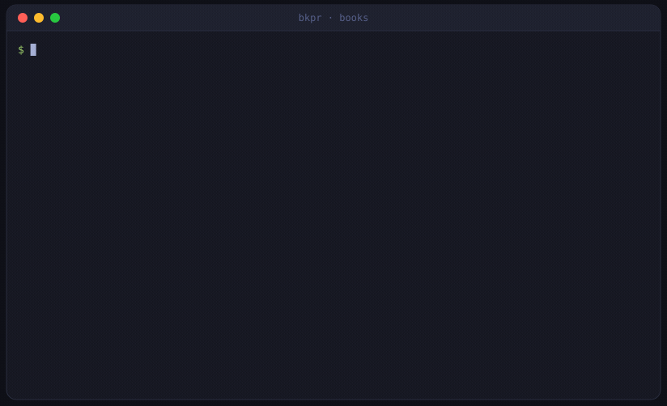

# bkpr


Turns bank and card statements into a set of books.



The goal is Mint's touch with a real ledger's resolution: you set it up, it runs, and the only
recurring work is re-categorizing a couple of things every once in a while. It is driven entirely
through commands, so it does not matter whether a person or an agent operates it: `books -format
json` reports the whole books, every write is safe to repeat, and the only trace of who ran a
command is `-actor` (default `human`, e.g. `-actor claude`), stamped on it in the log.

**[docs/DESIGN.md](docs/DESIGN.md) has the reasoning behind all of this:** why every line posts,
why the log is the only thing ever written, and how rules, corrections, connectors, and accrual
fit together. This page is everything you need for the first couple of minutes.

## Install

Each tagged release ships a prebuilt `bkpr` for macOS and Linux, so another machine
runs bkpr without a Go toolchain. Download the binary for your system, mark it
executable, and put it on your `PATH`:

```sh
# pick your os/arch: darwin-arm64, darwin-amd64, linux-arm64, linux-amd64
os_arch="darwin-arm64"
curl -fsSL -o bkpr "https://github.com/BKPR-Pro/bkpr/releases/latest/download/bkpr-${os_arch}"
chmod +x bkpr
sudo mv bkpr /usr/local/bin/     # anywhere on your PATH

bkpr version                     # confirms which release you have
```

Each release also carries a `checksums.txt`; verify the download against it before trusting the
binary if you like. To build from a checkout instead, see [Quickstart](#quickstart) below.

## Quickstart

```sh
go build -o bkpr ./cli      # bkpr is the short name used throughout

bkpr init
bkpr import statement.csv -account "Assets:Bank:Chequing" -currency CAD -amount Amount
bkpr books                  # every line and where it posted
bkpr books -account Uncategorized   # only the lines the rules could not place
bkpr rules set "shell|petro" -category "Expenses:Travel:Fuel" -payee "Fuel Stop"
bkpr books                  # the whole history, reclassified by the rule you just wrote
```

`bkpr help <command>` explains one command; `bkpr docs` prints the whole reference. One grammar
throughout: the thing a command acts on (a file, a connector, a rule's pattern, a fingerprint) is
its first argument, and flags assert facts about it. Wherever a fingerprint is taken, a unique
prefix is enough, as with a git hash.

## Commands

| group | commands |
| --- | --- |
| **Setup** | `init`, `reset`, `connectors register/rm/list` |
| **Rules** | `rules set/rm/mv/list` |
| **Bookkeeping** | `import`, `categorize`, `comment`, `void`, `match`, `export`, `books`, `register` |
| **Invoices and bills** | `invoice raise/settle/void/list/aging`, `bill receive/settle/void/list/aging` |
| **Policies and documents** | `policy set/list`, `accounts set/list`, `balance set`, `reconcile`, `receipt`, `report` |
| **More** | `completion`, `help`, `docs`, `version` |

Rules are the deterministic layer that handles almost everything for free; bookkeeping is where
you or an agent answer the lines the rules could not place. Invoices and bills add an accrual view
on top of the same log, and policies/documents cover cost-basis method, account metadata,
reconciliation against the bank, and printable output. See [docs/DESIGN.md](docs/DESIGN.md) for
what each of these is actually doing under the hood.

## Why it works this way

> **The log holds only what cannot be recomputed. Everything else is a fold.**

A statement line, a rule, and an answer where the rules ran out are all judgments nobody could
recompute, so they are the only things ever written down. Everything else, the categorization,
the transfer pairing, the cost base, the ledger file itself, is derived fresh every time. That is
what makes fixing a mistake cheap: **fix the rule, not the line**, and the whole history behind it
reclassifies in one appended event.

It also means nothing is ever guessed. **Truncate, do not guess**: a hardware charge that could
serve any property posts to `Materials:Uncategorized` rather than to a unit picked at random,
because a wrong leaf costs only insight, but a wrong kind breaks the books. `Uncategorized` is not
an inbox to clear; it is a pointer to a rule you have not written yet, and there is no `confirmed`
event because silence is the confirmation.

The full case for each of these, the events table, the storage guarantees, cash vs. accrual,
cost basis, and the connector architecture, is in [docs/DESIGN.md](docs/DESIGN.md).

## Design rules

- **Deterministic where money is recorded.** Every capability is a command with machine-readable,
  idempotent I/O, so a person or an agent runs the tool the same way. Whoever operates it proposes;
  code writes. The books stay a pure function of the log.
- **Idempotent end to end.** Every line carries a stable fingerprint, scoped to the door it
  entered through (a connector's name, a file's name) rather than the account it lands in, so a
  re-import is always safe, even across re-pointing a connector to a new account. Two genuinely
  identical charges on one day stay two charges.
- **An amount is an exact quantity of a commodity.** Held as integer minor units, so no float ever
  touches the books, and the commodity may be a currency or a share. Ledger-cli's model, which is
  why the books can hold anything ledger can.
- **Connectors know the outside world; the core does not.**
- **Say only what is known.** Truncate an account path rather than guess a leaf, and never guess a
  kind.
- **Nothing blocks.** Every line posts, an unknown one truncates to `Uncategorized` rather than
  stopping the run, and every correction is cheap because regenerating is cheap.

## Development

```sh
go test ./...
go vet ./...
gofmt -l .
go build ./cli
```

Every change is test-first, and the git hooks run `gofmt`, `go vet`, the tests, and markdownlint
on commit. See [docs/DESIGN.md](docs/DESIGN.md#extending-bkpr) for the conventions to follow when
adding a new view, input, authored fact, or destination.
